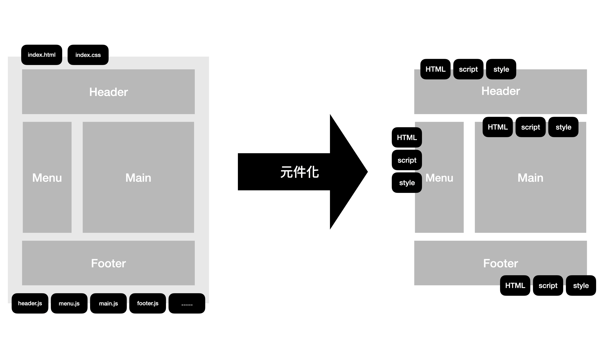
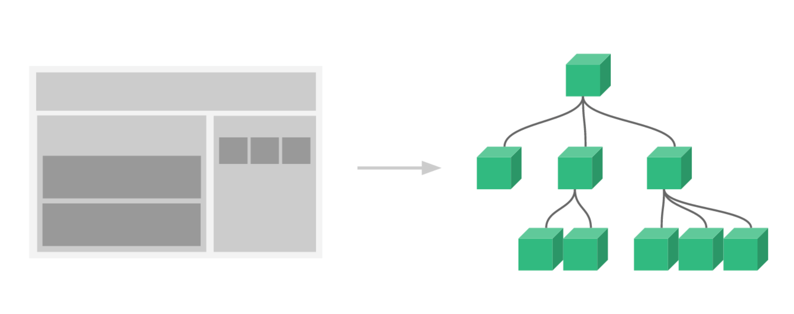

# 1. 组件基础

## 1.1 什么是组件

组件(Component)是 Vue 最主要也是最强大的特性之一， 它提供了 HTML DOM 元素的扩展性，可以将部分模板、程序代码封装起来以便开发者维护以及重复使用。

传统网页的结构， 从最早期的 把所有的东西统统塞到 HTML 中，到后来 CSS、JavaScript 从 HTML 结构中抽离，这是表现层级上到关注点分离。

但是当项目的结构越来越复杂，人们开始把「关注点」从表现层移动到了架构层面，思考如何将功能、逻辑抽象化，将封装好的 UI 模块，功能重复使用，就如同乐高积木一样。



```html
<div id="app">
  <header-component>...</header-component>
  <menu-component>...</menu-component>
  <main-component>...</main-component>
  <footer-component>...</footer-component>
</div>
```

每一个被封装后的组件单元，都含有自己的模版、样式、行为逻辑，并且可以被重复使用。而在组件中又可以含有组件，这样由一个个组件通过组合就形成了我们的页面视图了。



## 1.2 组件的分类

当我们开始要把网页转换成组件区域来管理的是，首先面临的问题是，组件应该怎么拆，从哪里开始拆起。
要是范围切的太大，组件过于庞大，切的太细则组件数量太多。再有，组件之间要是彼此耦合程度高，反而不容易维护，还不如不拆。那么，接下来我们看看常见的组件分类方法：

* **展示型组件**

负责呈现 UI 为主的类型，我们很单纯地把资料传递进去，然后 DOM 就根据我们传递进去的数据生成出来。这种组件的好处是可以提升 UI 的重复使用。

* **容器型组件**

负责与数据层的 service 沟通， 包含了与 server 端、数据来源做沟通的逻辑，然后再将数据传递给前面所说的展示型组件。

* **互动型组件**

负责互动的逻辑，比如 elementUI、bootstrap等 UI Library 都属于这种类型。强调重复使用，像是表单、灯箱等各种互动元素都属于这个类型

* **功能型组件**

这个类型的组件本身不渲染任何内容，主要负责将组件内容作为某种应用的延伸，或是某种机制的封装。像是`<transition>`、`<rouuter-view>`等。

## 1.3 组件注册

### 1.3.1 全局组件

```html
<script>
    // 创建Vue实例
    const app = Vue.createApp({
      data() {
        return {
          name: "WanLum"
        }
      }
    });

    app.component("组件名称", {
      template: `模板`,
      data() {
        // ...省略代码
      },
      methods: {
        // ...省略代码
      },
      computed: {
        // ...省略代码
      },
      // ...以及其他选项、各种 lifecycle等
    })

    // 把Vue实例挂载在id为app的div上
    vm.mount('#app');
  </script>
```

### 1.3.2 局部组件

```html
<script>
 const app = Vue.createApp({
      data() {
        // ...省略代码
      },
      components: {
        组件名称: {
          template: `模板`,
          data() {
            // ...省略代码
          },
          methods: {
            // ...省略代码
          },
          computed: {
            // ...省略代码
          },
          // ...以及其他选项、各种 lifecycle
      }
    });
  </script>
```

## 1.4 组件的命名规则

虽然说只要是合法的 JavaScript 属性名，都可以被当作 Vue 组件的名称，但是由于组件咋模板中是以 标签 的形式来使用，为了避免与现在或未来的标签名称产生冲突，通常会以两个以上的单词来进行命名，如`<todo-item>`、`<base-table>`等。

另外，我们在注册元件的时候，可以使用首字母大写驼峰命名法(pascal-case)来为组件命名

需要注意的是，若直接以 HTML 當作模板的情況下，由於瀏覽器**在解析 HTML 標籤的時候，並無大小寫之分**，使用上必須改寫為連字號標籤